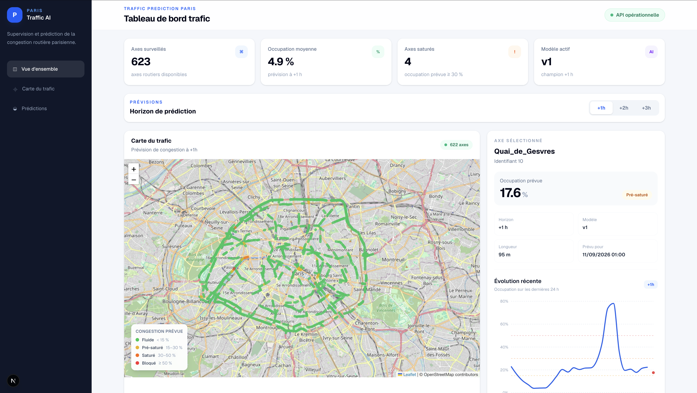

# 🚦 Traffic Prediction Paris

> Plateforme end-to-end de prédiction de la congestion routière à Paris, capable d'estimer l'occupation du trafic à **+1h, +2h et +3h**.


---

## 📌 Présentation

**Traffic Prediction Paris** est un projet Machine Learning / Data Engineering dont l'objectif est de prédire l'évolution de la congestion routière à Paris.

La plateforme exploite les données de comptage routier de **Paris Open Data** et construit une chaîne complète allant de l'ingestion des données jusqu'à leur visualisation dans un dashboard web.

Le système permet notamment de :

- collecter automatiquement les données de trafic ;
- nettoyer et stocker les observations ;
- construire les features nécessaires au Machine Learning ;
- entraîner des modèles de prédiction ;
- prédire la congestion à **+1h, +2h et +3h** ;
- comparer les modèles à une baseline de persistance ;
- suivre les expérimentations et versions avec MLflow ;
- promouvoir automatiquement les modèles répondant aux critères de qualité ;
- orchestrer les pipelines avec Airflow ;
- exposer les prédictions via une API FastAPI ;
- superviser l'application avec Prometheus et Grafana ;
- visualiser les résultats sur une carte interactive de Paris.

Le projet couvre ainsi plusieurs dimensions d'un système ML en production :

**Data Engineering → Machine Learning → MLOps → API → Monitoring → Frontend**

---

## 🖥️ Dashboard

Le dashboard permet de visualiser l'état prédit du trafic parisien et de sélectionner l'horizon de prédiction souhaité.


### Fonctionnalités

- visualisation des axes routiers sur une carte interactive ;
- prédictions à **+1h / +2h / +3h** ;
- occupation moyenne du réseau ;
- nombre d'axes saturés ;
- identification des axes les plus critiques ;
- historique récent d'un axe ;
- prévision future pour l'axe sélectionné ;
- version du modèle actuellement utilisée ;
- interface responsive desktop, tablette et mobile.

<!-- Ajouter ici une capture d'écran du dashboard -->

```text
docs/images/dashboard.png
```

---

## 🏗️ Architecture

```text
                        ┌─────────────────────┐
                        │   Paris Open Data   │
                        │      Traffic        │
                        └──────────┬──────────┘
                                   │
                                   ▼
                        ┌─────────────────────┐
                        │     Ingestion       │
                        │ Incremental / Bulk  │
                        └──────────┬──────────┘
                                   │
                                   ▼
                        ┌─────────────────────┐
                        │     PostgreSQL      │
                        │ Traffic / Roads /   │
                        │    Predictions      │
                        └──────────┬──────────┘
                                   │
                    ┌──────────────┴──────────────┐
                    │                             │
                    ▼                             ▼
          ┌───────────────────┐         ┌───────────────────┐
          │ Feature Pipeline  │         │ Inference Pipeline│
          └─────────┬─────────┘         └─────────┬─────────┘
                    │                             │
                    ▼                             │
          ┌───────────────────┐                   │
          │     LightGBM      │◄──────────────────┘
          │ +1h / +2h / +3h   │
          └─────────┬─────────┘
                    │
                    ▼
          ┌───────────────────┐
          │      MLflow       │
          │ Tracking/Registry │
          └───────────────────┘


                 Orchestration : Apache Airflow
                           │
                           ▼
                  ┌───────────────────┐
                  │      FastAPI      │
                  └─────────┬─────────┘
                            │
               ┌────────────┴────────────┐
               │                         │
               ▼                         ▼
      ┌─────────────────┐       ┌─────────────────┐
      │ Next.js         │       │ Prometheus      │
      │ Dashboard       │       │ + Grafana       │
      └─────────────────┘       └─────────────────┘
```

---

## 🧰 Stack technique

| Domaine | Technologies |
|---|---|
| Langage | Python 3.12 |
| Data processing | Pandas, PyArrow |
| Machine Learning | LightGBM, scikit-learn |
| MLOps | MLflow |
| Orchestration | Apache Airflow |
| API | FastAPI |
| Base de données | PostgreSQL |
| ORM | SQLAlchemy |
| Migrations | Alembic |
| Monitoring | Prometheus, Grafana |
| Infrastructure | Docker, Docker Compose |
| Frontend | Next.js, React, TypeScript |
| Data visualization | Recharts, Leaflet |
| Qualité Python | Ruff |
| CI | GitHub Actions |

---

# 🔄 Pipeline de données

## 1. Ingestion

Les observations sont récupérées depuis les données ouvertes de la Ville de Paris.

Le pipeline prend en charge :

- la pagination de l'API ;
- la normalisation des données ;
- les timestamps ;
- la sélection des axes exploitables ;
- l'ingestion incrémentale ;
- l'import massif de données historiques ;
- la persistance dans PostgreSQL.

Le système travaille sur plusieurs centaines d'axes routiers parisiens.

---

## 2. Nettoyage

Les données brutes sont nettoyées avant leur utilisation.

Le traitement gère notamment :

- les observations invalides ;
- les valeurs manquantes ;
- les doublons ;
- les timestamps ;
- les valeurs de trafic non exploitables ;
- la continuité temporelle.

---

## 3. Feature engineering

Les modèles utilisent plusieurs familles de variables.

### Features temporelles

Exemples :

- heure ;
- jour de la semaine ;
- week-end.

### Historique du trafic

Des variables retardées permettent au modèle d'exploiter l'évolution récente du trafic :

```text
q_lag_1h
k_lag_1h

q_lag_2h
k_lag_2h

q_lag_24h
k_lag_24h
```

### Données calendaires

Le pipeline peut également enrichir les observations avec :

- jours fériés ;
- vacances scolaires.

### Contexte routier et externe

Des enrichissements supplémentaires ont été étudiés, notamment :

- caractéristiques des axes routiers ;
- météo ;
- événements.

Les différentes familles de features ont été évaluées avant la sélection de la configuration finale.

---

# 🎯 Prédiction multi-horizon

Le système entraîne des modèles indépendants pour trois horizons :

```text
+1 heure
+2 heures
+3 heures
```

L'objectif est de prédire la variable :

```text
k = taux d'occupation de la chaussée
```

Une valeur élevée de `k` indique une congestion plus importante.

Le pipeline utilise un schéma de features commun afin de garantir la cohérence entre :

```text
training
   ↓
model registry
   ↓
inference
```

---

# 🤖 Machine Learning

Le modèle retenu est **LightGBM**.

Une baseline de persistance est utilisée comme référence :

```text
k(t + h) ≈ k(t)
```

Autrement dit, la baseline suppose que l'état futur du trafic restera identique à l'état actuel.

Le modèle ML doit apporter une amélioration par rapport à cette référence simple.

---

## 📊 Résultats

Les modèles entraînés obtiennent approximativement les performances suivantes :

| Horizon | LightGBM MAE | Persistence MAE |
|---|---:|---:|
| +1h | **1.79** | 2.20 |
| +2h | **2.21** | 3.13 |
| +3h | **2.45** | 3.88 |

Les performances montrent que LightGBM améliore la baseline sur les trois horizons.

On constate également une évolution logique de l'erreur : plus l'horizon de prédiction augmente, plus l'incertitude devient importante.

---

# 🧪 MLflow

MLflow est utilisé pour gérer le cycle de vie des modèles.

Il permet de suivre :

- les expériences ;
- les paramètres ;
- les métriques ;
- les artefacts ;
- les versions des modèles ;
- les modèles candidats ;
- les modèles utilisés pour l'inférence.

Les modèles sont enregistrés séparément selon leur horizon de prédiction.

```text
Traffic Prediction +1h
Traffic Prediction +2h
Traffic Prediction +3h
```

---

## 🏆 Promotion automatique

Le pipeline de training contient un **quality gate**.

Après l'entraînement :

```text
Train candidate
      ↓
Evaluate
      ↓
Compare with baseline
      ↓
Quality gate
      ↓
Promote / Reject
```

Un modèle candidat n'est donc pas automatiquement utilisé en production simplement parce qu'un nouvel entraînement a été exécuté.

Il doit respecter les critères de qualité définis par le pipeline.

---

# 🔁 Retraining automatique

Le système dispose d'un pipeline de réentraînement périodique.

Le processus :

```text
New traffic data
       ↓
Incremental ingestion
       ↓
Dataset update
       ↓
New data detected?
       │
       ├── No ──► Skip training
       │
       └── Yes
             ↓
       Feature engineering
             ↓
       Train +1h/+2h/+3h
             ↓
       Quality gate
             ↓
       Model promotion
```

Le contrôle de nouveauté évite donc de réentraîner inutilement les modèles lorsque les données n'ont pas changé.

---

# 🌬️ Airflow

Apache Airflow orchestre les pipelines principaux.

Deux catégories de workflows sont notamment utilisées.

### Inference pipeline

Le pipeline d'inférence est exécuté périodiquement afin de :

```text
ingérer les dernières observations
            ↓
préparer les features
            ↓
charger les modèles actifs
            ↓
générer les prédictions
            ↓
stocker les résultats
```

### Training pipeline

Le pipeline d'entraînement prend en charge :

```text
ingestion
   ↓
dataset
   ↓
features
   ↓
training
   ↓
evaluation
   ↓
MLflow
   ↓
promotion
```

Les DAGs restent volontairement légers : la logique métier est placée dans les packages Python réutilisables.

---

# 🗄️ PostgreSQL

PostgreSQL constitue la couche de persistance principale.

Elle stocke notamment :

- les axes routiers ;
- les observations de trafic ;
- les prédictions.

Les prédictions contiennent également leur horizon :

```text
horizon_hours = 1
horizon_hours = 2
horizon_hours = 3
```

Les évolutions de schéma sont gérées avec **Alembic**.

---

# ⚡ API FastAPI

L'API expose les données nécessaires aux consommateurs et au dashboard.

Version actuelle :

```text
v0.3.0
```

### Health check

```http
GET /health
```

### Axes routiers

```http
GET /roads
```

### Dernières prédictions

```http
GET /predictions/latest?horizon_hours=1
```

### Prédiction d'un axe

```http
GET /predictions/{iu_ac}?horizon_hours=1
```

### Historique d'un axe

```http
GET /roads/{iu_ac}/history?hours=24&horizon_hours=1
```

### Métriques Prometheus

```http
GET /metrics
```

L'horizon peut être sélectionné avec :

```text
horizon_hours=1
horizon_hours=2
horizon_hours=3
```

---

# 📈 Monitoring

La plateforme intègre :

**Prometheus** pour la collecte des métriques et **Grafana** pour leur visualisation.

Le monitoring permet de superviser l'état de la plateforme et du pipeline de prédiction.

```text
FastAPI
   │
   ▼
/metrics
   │
   ▼
Prometheus
   │
   ▼
Grafana
```

---

# 🗺️ Dashboard Next.js

Une application frontend dédiée permet d'explorer les prédictions.

Stack :

```text
Next.js
React
TypeScript
Tailwind CSS
Leaflet
Recharts
```

La carte permet de visualiser les axes selon leur niveau de congestion prévu.

Exemple de classification :

| Occupation `k` | État |
|---:|---|
| `< 15` | Fluide |
| `15 – 30` | Pré-saturé |
| `30 – 50` | Saturé |
| `≥ 50` | Bloqué |

Le dashboard permet également de basculer dynamiquement entre les modèles :

```text
+1h
+2h
+3h
```

---

# 🐳 Docker

Les principaux composants de la plateforme peuvent être exécutés dans des conteneurs Docker.

L'environnement regroupe notamment :

```text
PostgreSQL
Redis
Airflow
MLflow
FastAPI
Prometheus
Grafana
Nginx
```

Docker Compose facilite le lancement et le développement local de l'ensemble de la stack.

---

# 📁 Organisation du repository

```text
traffic-prediction-paris/
│
├── packages/
│   ├── shared/
│   │   └── shared/
│   │
│   └── traffic_prediction/
│       └── traffic_prediction/
│           ├── features/
│           ├── inference/
│           ├── ingestion/
│           ├── models/
│           ├── monitoring/
│           ├── pipelines/
│           ├── processing/
│           ├── selection/
│           ├── storage/
│           └── utils/
│
├── services/
│   ├── api/
│   ├── airflow/
│   ├── training/
│   └── mlflow/
│
├── deployments/
│   ├── grafana/
│   ├── nginx/
│   └── prometheus/
│
├── migrations/
│
├── scripts/
│
├── data/
│
├── .github/
│   └── workflows/
│       └── ci.yml
│
├── compose.yaml
├── compose.override.yaml
└── README.md
```

Cette organisation sépare la logique métier des différents services et permet aux pipelines, scripts et services de réutiliser les mêmes composants Python.

---

# 🔄 CI

GitHub Actions assure automatiquement les contrôles de qualité du backend lors des pushes et pull requests.

La CI vérifie notamment :

```text
Ruff
  ↓
Python compilation
  ↓
Tests
```

Les contrôles sont exécutés sur les branches principales du projet afin de détecter rapidement les régressions.

---

# 🚀 Lancement local

## Prérequis

- Python 3.12
- Docker
- Docker Compose
- Git

Cloner le repository :

```bash
git clone <repository-url>
cd traffic-prediction-paris
```

Créer l'environnement Python :

```bash
python -m venv .venv
source .venv/bin/activate
```

Installer les packages internes :

```bash
pip install -e ./packages/shared
pip install -e ./packages/traffic_prediction
```

Créer le fichier d'environnement nécessaire à partir de la configuration du projet.

Puis démarrer l'infrastructure :

```bash
docker compose up -d
```

Vérifier les services :

```bash
docker compose ps
```

---

# 🧭 Évolution du projet

Le projet a été construit progressivement.

### V0 — Exploration

- analyse des données Paris Open Data ;
- étude de la continuité temporelle ;
- analyse des valeurs manquantes ;
- sélection des axes exploitables.

### V1 — Baseline ML

- feature engineering temporel ;
- lags trafic ;
- baseline de persistance ;
- modèles Machine Learning ;
- évaluation temporelle.

### V2 — Enrichissement

- jours fériés ;
- vacances scolaires ;
- météo ;
- événements ;
- informations routières ;
- ablation study ;
- LightGBM ;
- MLflow.

### V3 — Industrialisation

- PostgreSQL ;
- Alembic ;
- FastAPI ;
- Docker ;
- Airflow ;
- MLflow Model Registry ;
- quality gate ;
- inference périodique ;
- retraining automatique ;
- prédiction multi-horizon ;
- Prometheus ;
- Grafana ;
- dashboard Next.js ;
- CI GitHub Actions.

---

# 🔮 Améliorations possibles

Plusieurs évolutions peuvent prolonger le projet :

- tests unitaires et d'intégration plus complets ;
- monitoring de data drift et model drift ;
- alerting automatique ;
- optimisation des hyperparamètres ;
- enrichissement avec davantage de données événementielles ;
- déploiement cloud ;
- authentification de l'API ;
- stratégie de rollback automatique des modèles ;
- tests end-to-end du frontend.

---

# 🎓 Objectifs du projet

Ce projet a été développé dans une démarche de montée en compétence et de portfolio autour des métiers :

- **Machine Learning Engineer**
- **Data Engineer**
- **Data Scientist**

L'objectif n'était pas uniquement d'entraîner un modèle performant, mais de construire une architecture permettant de gérer **l'ensemble du cycle de vie d'un système Machine Learning** :

```text
Data ingestion
      ↓
Data quality
      ↓
Feature engineering
      ↓
Training
      ↓
Evaluation
      ↓
Experiment tracking
      ↓
Model registry
      ↓
Model promotion
      ↓
Inference
      ↓
API
      ↓
Monitoring
      ↓
Visualization
```

---

## 👤 Auteur

**Destin Gando**

Machine Learning Engineer / Data Engineer

Projet portfolio — Paris, France.